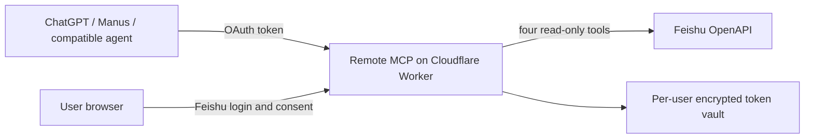

# Feishu Connect

**让你的 AI 助手，读到飞书里的工作资料。**

Read-only Feishu Docs and Wiki access for cloud AI agents through a hosted, OAuth-protected MCP server. Your agent searches and reads original sources; Feishu Connect does not run a model, summarize documents, or build a copy of your knowledge base.

> **Development preview, not yet a hosted service.** The read-only core and OAuth server compile; local synthetic tests pass. Feishu app authorization, deployment, real account isolation, ChatGPT/Manus calls, and multi-day operation still require verification. Do not enter company credentials into an unverified deployment.

## Why this exists

Many cloud agents offer easy connections to international apps, while Feishu content remains difficult to reach without a local CLI or manual copying. Feishu Connect gives an organization a hosted connector: an administrator configures one Feishu app; invited users connect through their browser and ask their existing agent to find and read documents.

The first release is deliberately small: **keyword search, Docx text, Wiki navigation, and connection status**. It uses the signed-in user's Feishu permissions. No editing, chats, calendar, full-text mirror, vector database, or model API key.

## Agent compatibility

| Agent | Path | Current project status |
| --- | --- | --- |
| ChatGPT | Remote MCP with OAuth, where the account has the custom connector entry | Protocol target; live connection not yet verified |
| Manus | Custom remote MCP server | Protocol target; live connection not yet verified |
| Cue (Manus) | Depends on Cue exposing a connector or inheriting Manus configuration | No verified self-service entry yet |
| Muse (Meta) | Apply through the [Muse Connector Platform](https://muse.ai/platform) | Submission and approval not attempted; no direct user-side MCP entry verified |

Supporting a remote MCP protocol does **not** mean a product has listed this connector. We will mark each client compatible only after a real add → authorize → search → read test in that product. See the [research](docs/RESEARCH_2026-09-29.md) and [acceptance status](docs/ACCEPTANCE_STATUS.md).

## Four read-only tools

| Tool | What it returns |
| --- | --- |
| `search` | Current user's keyword matches across visible documents and Wiki pages, with links and truthful pagination limits |
| `fetch` | Original Docx text, revision, source link, explicit omissions, and signed continuation cursor |
| `list_wiki` | Visible spaces or one level of nodes, with a next-page cursor |
| `connection_status` | Connection state and available read scopes, never the underlying token |

Example prompts after a verified connection:

> Find the latest Feishu requirements document for Project A, read the original text, and cite the source link.
>
> List the pages under this Wiki node, then compare the two plans I name. Mark any images or attachments you could not read.

The service returns source material. The agent must not claim it read a whole Wiki from one directory page or invent the content of images and attachments.

## Architecture



The OAuth provider validates the client, redirect URI, PKCE, token audience, and grant. The Worker checks scope and current connection state on every MCP request. A per-user Durable Object holds encrypted Feishu credentials and serializes refresh. User content is fetched on demand and not indexed or persisted by this code. Cursor signatures bind a continuation to the user, client, resource, and revision.

## Develop locally

Requires Node.js 22+ and a Cloudflare account for Worker deployment.

```sh
git clone https://github.com/Azurboy/feishu-connect.git
cd feishu-connect
npm ci
npm run check
npm test
npx wrangler deploy --dry-run
```

The checked-in `wrangler.jsonc` contains placeholders and cannot serve real users. Deployment requires a dedicated Feishu self-built app with a redirect URL ending `/callback`, these **user** scopes: `search:docs:read`, `docx:document:readonly`, `wiki:wiki:readonly`, `offline_access`; a Cloudflare KV namespace; a service URL; the tenant's Feishu base URL; explicit tenant and user allowlists; and Worker secrets `FEISHU_APP_SECRET`, `CURSOR_SECRET`, `VAULT_KEY`. Keep all secret values out of Git. Do not reuse another project's Feishu App Secret or a local CLI token.

`FEISHU_BASE_URL` is the organization's real `https://…feishu.cn/` document origin. The service never fetches a URL supplied to `fetch`: it parses an allowed Feishu document URL, then calls fixed official OpenAPI endpoints with that user's UAT. Read access still depends on both app grants and the user's resource permissions.

Current deployment instructions are intentionally incomplete until Feishu OAuth, refresh, revocation, and real client calls pass the [specification](docs/SPEC_v0.1.md). The service is restricted to one configured tenant and invited users in this phase. Cross-enterprise self-service requires Feishu app distribution and separate platform review.

## Privacy and safety

Only title, document text, source URL, and version requested by a tool are returned to the connected agent. Images, files, embedded Sheets, Bitable, and other unsupported content are marked unread. Feishu user tokens are never handed to an agent. An AI product may retain material returned to it under its own settings; disconnecting this service cannot erase a product's previous chat history.

Do not include access tokens, real document text, private URLs, or company names when filing a bug. Report security issues privately as described in [SECURITY.md](SECURITY.md).

This project is MIT licensed. It is separate from [Feishu Calendar Bridge](https://github.com/Azurboy/feishu-gcal-bridge), which mirrors one Feishu calendar into a Google Calendar that existing agents can already read.
