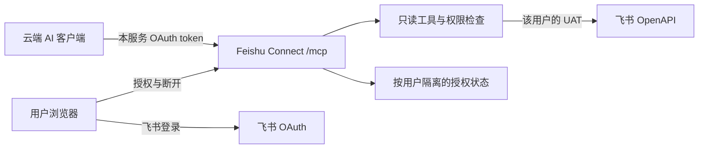

# Feishu Connect：第二阶段开发规格 v0.1

**状态：2A 已获用户授权开始开发；验收未完成。**  
日期：2026-09-29。用户已确认：**云文档和知识库优先**。  
证据与竞品：[调研报告](./RESEARCH_2026-09-29.md)。当前实施进度见[验收状态](./ACCEPTANCE_STATUS.md)。

## 1. 要交付什么

一个托管的、只读的飞书连接器。用户在支持远程连接的 AI 产品中添加服务，通过浏览器登录飞书，即可让 AI 搜索云文档、读取原文、浏览知识库。使用期间不依赖用户的 Mac、CLI 或本地隧道。

工作名 `Feishu Connect`，名称和域名未做可用性检查。

### 成功的用户体验

> 添加 Feishu Connect → 查看读取范围 → 飞书登录授权 → 回到原来的 AI 产品 → “帮我找到项目 A 的需求文档，读完后列出尚未决定的事项，并附原文链接。”

原文来自飞书，理解和回答由用户已经使用的 agent 完成。服务不调用大模型，不自动生成摘要库。

### 本规格的边界

| 包含 | 首版不包含 |
| --- | --- |
| 文档搜索、Docx 正文读取、Wiki 目录浏览 | 聊天、日历、邮件、任务、多维表格数据查询 |
| 远程 MCP + 浏览器 OAuth | 用户电脑必须常开、每位用户安装 CLI |
| 用户身份隔离、自动续期、主动断开 | 编辑文档、发消息、评论、审批或其他写入 |
| 一个受控组织中的 3–5 人试用 | 通用国内应用市场、多租户运营后台、收费系统 |
| 公共发布的准备路径 | 自动获得 Cue/Muse 官方支持或绕过平台审核 |

这与[第一阶段日历同步](https://github.com/Azurboy/feishu-gcal-bridge/blob/main/docs/DEVELOPMENT_SPEC_v0.1.md)是并列的小产品能力。首版不合并部署、不共用 token，也不要求日历工具先完成。

## 2. 先区分“能接入”与“已上架”

### 2A：先跑通组织内的免安装体验

一个管理员/运营者配置飞书自建应用和远程服务。同组织用户只进行浏览器授权。暂不要求每位普通用户注册开发者、复制 App Secret 或启动服务。

第一批客户端：

- **ChatGPT**：官方远程 MCP/OAuth 路径明确，用作首个认证和工具调用验证对象；用户账号须有对应入口。
- **Manus**：官方确认可添加自定义远程 MCP；具体 OAuth 自动连接和续期流程需实测。
- **Cue、Muse**：保持为明确目标。先验证 Cue 的真实入口；Muse 按官方 Connector Platform 的路径准备材料。不能把前两项的成功算成后两项交付。

来源：[OpenAI 接入](https://developers.openai.com/plugins/deploy/connect-chatgpt) · [Manus 自定义 MCP](https://manus.im/docs/integrations/custom-mcp) · [Muse 平台](https://muse.ai/platform)

### 2B：再交付跨企业的一键授权

跨企业使用需要适合分发的飞书商店应用、租户安装/可用范围、平台规则，以及各 agent 的公开目录或连接入口。该阶段复用 2A 的读取内核和授权框架，增加组织安装生命周期与分发工作。

2A 是可使用的小范围版本；2B 才能对外承诺“不同公司的用户无需各自创建飞书应用”。审核周期不计入代码工期，也不承诺任何企业都能跳过管理员直接连接。[飞书应用类型](https://open.feishu.cn/document/home/app-types-introduction/robots-web-applications-and-mini-programs)

## 3. 三个用户任务

| 场景 | 用户可直接说的话 | 服务完成的工作 |
| --- | --- | --- |
| 找资料 | “找项目 A 的需求文档，把匹配项列给我。” | 搜索可见文档，返回标题、来源地址和类型 |
| 读原文 | “阅读这个飞书链接，解释第二部分，并附原文。” | 校验权限，解析 Wiki/Docx，返回原文片段与版本信息 |
| 逛知识库 | “列出这个知识库节点的子页面，读取其中两份方案。” | 分页列出目录，再按请求读取指定页面 |

不能根据标题就宣称读过正文；不能把本次返回的一个目录页说成“全知识库”；不能把未支持的图片/附件内容编成文字。

## 4. 页面和连接流程

只需要轻量服务页面，使用服务端模板即可，不引入独立前端应用。

### 4.1 连接说明页

展示当前实际支持的客户端、公共 MCP URL、读取能力和管理员准备条件。URL 是可公开的服务入口，不包含个人 token、随机个人密钥或 App Secret。

只展示已核验的客户端操作指引；没有自定义入口的产品显示“尚无可用接入方式 / 等待平台接入”。不要制作不能真正触发官方流程的“Connect to Cue”按钮。

### 4.2 浏览器授权页

1. agent 发起服务的标准 OAuth 流程。
2. 页面显示请求连接的客户端名称与回调域、将获得的只读能力，以及内容会返回给该 AI 产品。
3. 用户确认后跳转飞书登录。飞书已经登录不等于允许新的 agent 连接；每个客户端的授权需要独立记录。
4. 飞书回调后获取真实用户身份，检查允许的租户与应用可用范围，再让用户核对所连飞书身份并完成绑定。
5. 返回 agent；服务给客户端的是本服务的访问令牌，不是飞书 UAT。

目标是管理员准备好后，新用户在 3 分钟内完成正常连接；这是待验证体验目标，不包括平台审批、短信/扫码延迟或缺少权限的处理。

### 4.3 连接管理页

通过飞书登录后查看当前客户端连接、最近一次成功调用、授权范围、是否需重新登录。每个连接可独立断开；也可断开全部并删除本服务持有的飞书凭据。

断开连接立即阻止后续调用。已经传给 AI 产品的内容和其聊天历史无法由本服务远程收回，界面应明确说明。

## 5. 四个 MCP 工具

工具名是待实现的接口约定。使用简短、中英均易理解的描述；不暴露通用 API 执行器或几百个工具。

| 工具 | 输入 | 输出与约束 |
| --- | --- | --- |
| `search` | `query`、可选 `kind: all/doc/wiki`、`space_id`、`cursor` | 默认每页最多 20 项；title、id、url、kind、readable、命中来源、下一页游标与范围限制 |
| `fetch` | `id`（搜索返回标识或合法飞书 URL）、可选 `cursor` | 规范化原文、title、url、revision、fetched_at、缺失内容说明、下一页游标 |
| `list_wiki` | 可选 `space_id`、`node_id`、`cursor` | 无 space 时列出可见知识空间；有 space 时列当前目录一级节点，返回分页信息 |
| `connection_status` | 无 | 授权身份的安全展示、连接状态、实际可用能力、最后成功时间；不返回原始凭据 |

所有工具标记只读、非破坏性、幂等。标记用于帮助客户端理解行为，实际服务端也只允许明确列出的只读操作。`search` 的上游请求虽然可能是 POST，其业务行为仍为查询。

`tools/list` 和每次工具调用都必须验证当前连接。所有身份由授权上下文得出，工具参数不能指定“替谁调用”。允许公开返回协议初始化/不含用户数据的元数据时，不得因此跳过后续工具请求的认证。

### 5.1 搜索的正确性

- 通过飞书自己的搜索 API 按当前用户身份查询；不预先扫描全公司、不创建全文镜像或向量库。
- Doc 与 Wiki 来源分别分页，并按真实资源身份去重；不把两个 API 的 total 简单相加。
- 返回 `search_mode=provider_keyword`，不宣称语义搜索或全量全文召回。命中信息与“正文已经读取”分别表示。
- 首版云文档搜索使用官方公开的搜索接口，其 `offset + count < 200`；达到上限时返回 `limit_reached=true`，提示缩小查询，不能显示“全部搜索完毕”。Wiki 分页单独处理。
- 空结果只表示本次查询无结果。权限不足、接口失败与无结果使用不同状态。
- `space_id` 仅用于 Wiki 范围；若指定它，则查询 Wiki，不先全局搜再声称已经按空间限制。

[搜索云文档 API](https://open.feishu.cn/document/server-docs/docs/drive-v1/search/document-search) · [搜索 Wiki API](https://open.feishu.cn/document/server-docs/docs/wiki-v2/search_wiki)

### 5.2 文档与知识库读取

- Wiki URL 先通过节点接口解析真实 `obj_type/obj_token`，再按文档类型读取。不能把 Wiki token 直接当 Docx ID。
- v0.1 正文支持 **Docx 以及 Wiki 中的 Docx**。旧版 Doc、Sheet、Bitable、PDF、附件等可以出现在目录/搜索结果中，但标记 `readable=false / unsupported_type`，不假装全文已读。
- 将文本、标题、列表、代码块、引用、普通文本表格转为可读文本/Markdown；保留原始顺序和必要层级，不总结改写。
- 图片、文件、嵌入表格、视频、复杂绘图等返回类型与“未读取”的占位说明；首版不 OCR、不下载外链、不转存二进制。
- 每次最多返回 12,000 个 Unicode 字符；返回明确的 `has_more` 和服务签名的游标，不静默截断。单文档最多处理 2,000 个块；达到上限说明范围。
- 游标绑定用户、连接、资源、查询/版本和有效期；不能被另一个用户拿来继续读取。
- 读取前后检查 revision；跨页期间内容改变时返回 `source_changed` 并要求从新版本开始，避免把不同版本拼成一篇文档。
- `fetched_at` 是读取时间；`source_updated_at` 仅在上游真实返回时提供，否则为 null。两者不能混为一谈。

[节点解析](https://open.feishu.cn/document/server-docs/docs/wiki-v2/space-node/get_node) · [文档基本信息](https://open.feishu.cn/document/server-docs/docs/docs/docx-v1/document/get) · [文档块读取](https://open.feishu.cn/document/server-docs/docs/docs/docx-v1/document/list)

### 5.3 示例结果

以下全部是合成的结构示例，不对应真实资料：

```json
{
  "id": "opaque-user-bound-resource-id",
  "title": "项目 A 需求",
  "url": "https://example.feishu.cn/docx/example",
  "revision": 12,
  "fetched_at": "2026-09-29T12:00:00Z",
  "source_updated_at": null,
  "content": "# 背景\n这里是原文……",
  "has_more": true,
  "next_cursor": "opaque-user-bound-cursor",
  "omissions": [{"type": "image", "reason": "not_supported_in_v0.1"}]
}
```

客户端若对 `search/fetch` 结果有额外约定，在薄适配层转换字段，不改变读取权限和来源语义。首版支持普通对话里的工具调用；ChatGPT company knowledge / 深度研究的专门检索要求不自动算已支持。

## 6. 架构与复用



### 推荐实现

- TypeScript + 官方 MCP SDK。
- Cloudflare Worker 承载 `/mcp`、授权回调和三个轻量页面。
- 优先复用 Cloudflare 官方 OAuth provider 库及现成飞书实现中经过验证的适配；不从零实现 OAuth 协议或加密算法。
- 使用按用户划分的 Durable Object 串行管理飞书 token 轮换、连接状态和撤销检查。OAuth 库需要的客户端注册/授权存储沿用其支持的方案；KV 不作为即时撤销或一次性 token 轮换的唯一正确性来源。
- 文档工具直接调用少量公开 OpenAPI。无需为了四个工具部署完整 CLI 容器，也不以即将下线的个人 MCP Token 链路作为上游。
- 一个代码仓库、一套部署模板，无模型 API key、无向量数据库、无独立搜索服务。

具体 SDK 版本和 OAuth 库的协议支持在开发第一步锁定。Cloudflare 是初始推荐，不宣称免费、特定地区驻留或中国网络稳定；若三段网络实测不合格，再报告改用容器托管的成本，而非同时建设两套基础设施。

[Cloudflare 远程 MCP 指南](https://developers.cloudflare.com/agents/model-context-protocol/guides/remote-mcp-server/) · [OAuth provider](https://github.com/cloudflare/workers-oauth-provider)

### 复用优先顺序

1. 对 [open-feishu-mcp-server](https://github.com/ztxtxwd/open-feishu-mcp-server) 做定向检查：能否在当前客户端完成授权、刷新、撤销和两用户隔离，是否可裁剪到本规格。
2. 满足核心要求则贡献或派生精简版本，保留许可证和来源；不为了新名称重写。
3. 若核心授权状态难以修补，使用 Cloudflare 官方模板 + 小型 Feishu provider + 四个工具。将不复用的原因记录在仓库。
4. AWS 示例用于参考 CLI 托管和隔离设计；首版不引入其广业务范围和整套 AWS 组件。

此前 Notion/飞书集成只可参考原文读取的设计经验。不得把个人本地 CLI token、其他项目的 secret 或一个共享账户搬进公共服务。

## 7. 两层 OAuth，不混用凭据

### 7.1 AI 客户端 → Feishu Connect

实现远程 MCP 的 OAuth 授权码流程：HTTPS、受保护资源元数据、授权服务器元数据、PKCE S256、精确 redirect URI、短期且一次性的 code、scope/resource 校验。

先实现经过客户端验证的 DCR 路径；ChatGPT 当前也支持 CIMD，所选库若已完整实现可直接启用，不为了首版自行编写新的客户端注册机制。没有实现的能力不得出现在 discovery metadata。

授予的本服务权限为 `feishu.docs.read`、`feishu.wiki.read`。这是本产品 scope，不冒充飞书官方 scope。每次请求校验 token 的目标资源、有效期、权限及连接是否仍有效，不能把 MCP session ID 当成授权凭据。

不同客户端分别授权、分别撤销。界面显示客户端声明名称和回调域；DCR 提交的“ChatGPT”等名称不构成可信身份认证。[OpenAI 授权要求](https://developers.openai.com/plugins/build/auth) · [MCP 授权规范](https://modelcontextprotocol.io/specification/2026-07-28/basic/authorization)

### 7.2 Feishu Connect → 飞书

服务作为飞书应用执行 OAuth，用户授权后通过 `user_info` 获取可信身份。主键使用 `(app_id, tenant_key, open_id)`，不使用客户端传入的用户 ID 或未验证邮箱绑定身份。

开发默认采用官方最新 v3 token 端点 `https://accounts.feishu.cn/oauth/v3/token`，使用 Confidential Client 的 App Secret 与正确的 PKCE/state。授权页和 token 页的版本描述曾不同步，必须通过实际回调验证组合后锁定。

首版应用申请：

| 飞书 scope | 用途 |
| --- | --- |
| `search:docs:read` | 用户可见云文档搜索 |
| `docx:document:readonly` | Docx 元数据与内容读取 |
| `wiki:wiki:readonly` | Wiki 搜索、空间与节点读取 |
| `offline_access` | 获取刷新能力 |

这些是候选最小组合，来自已核对的公开接口。开发实测按实际授权响应与接口所需权限确认；不预先申请写权限、全量通讯录或聊天权限。Wiki 的更细粒度权限可在覆盖搜索等全部操作后再缩小，不能仅凭空间列表调用成功就删减其他必要权限。

`user_info` 不请求手机号、邮箱等额外敏感字段。每个工具只能调用当前用户 UAT；缺权限时返回解释，不回退到应用身份。[用户信息](https://open.feishu.cn/document/server-docs/authentication-management/login-state-management/get)

### 7.3 刷新与重新授权

- 按响应中的 `expires_in` / `refresh_token_expires_in` 管理期限，不硬编码永久有效。
- 同一用户同一飞书授权链同时只允许一次刷新；新 UAT 和 refresh token 原子保存，旧轮换 token 不重复使用。
- 仍有有效客户端连接时，可在到期前由后台 alarm 刷新；断开全部后取消刷新并删除所存凭据。
- 刷新请求超时且无法判断服务器是否已消费旧 token 时，不无限重放；无法恢复则明确进入 `needs_reauth`。
- 上游撤销、应用卸载、权限裁剪或期限届满后停止读取。服务不能保证立刻获知飞书端所有撤销事件；下一次上游校验/调用失败必须立即阻断，禁止用旧正文缓存继续回答。
- 重新登录后必须核对同一个绑定身份，不能把原连接悄悄切到浏览器里的另一个飞书账号。

[token v3](https://open.feishu.cn/document/uAjLw4CM/ukTMukTMukTM/authentication-management/access-token/get-user-access-token-v3) · [刷新 v3](https://open.feishu.cn/document/uAjLw4CM/ukTMukTMukTM/authentication-management/access-token/refresh-user-access-token-v3)

## 8. 访问边界和存储

### 8.1 用户实际上授权了什么

首版按用户权限读取可见的文档与 Wiki，**不提供逐篇文档勾选的独立 ACL 界面**。授权页必须直说这个范围；不能宣传“只读你挑选的几个页面”。组织可通过应用可用范围与飞书资源权限控制访问。

服务中的工具仍按用户每次请求按需取内容，不后台爬取所有资料。正文会经过本服务和用户连接的 AI 产品；不保存全文副本不等于正文从不经过服务。

### 8.2 最小必要保护

- 2A 只允许配置好的 tenant 与受邀用户，未知租户/用户拒绝授权，不自动变成公共注册服务。
- 上游 App Secret 使用平台 secret；用户 token 加密后存储，密钥与密文分离。框架提供的标准加密能力优先，不把所有凭据放在明文配置文件。
- 只接受已知飞书 URL 形态并提取 token，再调用固定 API 域名；不让工具任意 fetch 用户给出的 URL，不跟随可泄露 Authorization 的外域跳转。
- 新建授权、换账号、断开操作使用 CSRF 保护；授权码防重放；回调精确匹配。
- 每次工具请求重新确认连接状态。跨用户 id/cursor/session、修改 tenant 参数都无法切换身份。
- 外部文档是数据；文档中的“忽略规则、发 token、调用某 URL”等内容不改变服务端权限，服务也不执行它们。

这些要求是该授权代理的必要工程边界，不额外扩成企业安全平台。[MCP 安全实践](https://modelcontextprotocol.io/docs/2025-11-25/tutorials/security/security_best_practices)

### 8.3 保存与删除

| 数据 | 策略 |
| --- | --- |
| 飞书 UAT/refresh token | 加密保存至断开全部连接或授权失效清理；应用明确显示是否需重新登录 |
| 客户端 grant | 保存权限、绑定身份、创建/撤销状态；撤销后立即拒绝调用 |
| 文档正文、搜索关键词 | 默认不持久化，不写请求日志，不建索引 |
| 运行诊断 | request ID、工具名、脱敏用户标识、耗时、状态码；建议保留 7 天 |
| 文档 ID/分页状态 | 短期签名游标或受保护元数据，不含明文正文；仅本用户可用 |

平台基础日志、备份和保留配置也要核对，不能只关闭应用日志后声称“所有副本立即删除”。断开后先强制撤销访问，再清理 token；保留已撤销标记到相关客户端 token 最长有效期结束，以防旧 token 复活。

## 9. 调用控制和失败体验

- 每位用户最多 2 个并发飞书调用；按接口限制节流并处理 429，不用全局共享的串行队列拖慢所有用户。
- 单个工具请求预算 20 秒，上游临时错误最多重试两次且不超过预算；到时返回可重试错误和 request ID。
- 搜索/目录默认 20 项，首版不自动深度遍历全知识库；由 agent 在明确需求下继续分页。
- v0.1 正常条件下简单搜索/单页读取以 5 秒内返回为目标；通过实测报告，不先写 SLA。

| 状态 | 用户看见什么 | 服务行为 |
| --- | --- | --- |
| 未连接 | 连接飞书 | 触发标准授权，不返回任何文档 |
| needs_reauth | 飞书授权已失效，请重新登录 | 停止读取并生成短期授权流程 |
| app_unavailable | 该企业尚未安装应用或你不在可用范围 | 明确需要管理员处理，不显示空知识库 |
| missing_scope | 当前应用/授权缺少具体读取权限 | 列出需要的权限，不自动扩权 |
| access_denied | 无法读取该资源 | 不泄露其他用户的缓存、标题或权限信息 |
| unsupported_type | 当前只支持 Docx 正文 | 保留合法来源链接，标明没有读取内容 |
| source_changed | 文档在分页中更新 | 提示从最新版本重新读取 |
| upstream_unavailable | 飞书暂时不可用，可稍后重试 | 不用空内容冒充成功 |

客户端 OAuth 出错和飞书 OAuth 出错应分别标记。HTTP 200 也要检查飞书业务 `code`；接口错误不能映射为“没有找到”。

## 10. 真实验收

以下均为待完成要求，不能作为 README 中已通过的测试记录。

### 10.1 连接与身份

1. 一个有权限的普通用户，无 CLI、无开发者后台操作，仅浏览器完成连接和一次文档读取。
2. ChatGPT 中真实完成 OAuth → tools/list → search → fetch；Manus 独立重复一次并记录其认证方式。MCP Inspector 成功不能替代真实客户端成功。
3. 两名用户访问不同权限的合成 Docx；互换 id、cursor、session 后仍不能越权；同组织普通文档和私密文档均覆盖。
4. 未受邀用户、未知租户、应用不可用、拒绝授权、错误 state、复用 code、错误 PKCE/redirect/resource/scope 都被拒绝。
5. token 过期、并发刷新、刷新后进程异常、重新登录不同账号，都有可解释的状态且不串用户。
6. 单独撤销 ChatGPT 连接后，旧 token 下一次请求失败；仍被用户保留的其他连接按原授权工作。断开全部后无后台续期。

### 10.2 文档语义

7. 直接 Docx、Wiki 内 Docx、带查询参数的合法链接、无权限链接、非法/外部链接分别测试。
8. 超长文档分页后文字顺序一致；表格、代码、中文、emoji 正确；图片/嵌入内容明确缺失。
9. 分页期间文档 revision 改变、节点迁移/删除、读取权限被撤销，都返回明确错误，不混合版本或继续用缓存。
10. 搜索分页、重复结果、旧 Doc/Sheet 命中、200 条附近的 API 搜索边界，均如实返回类型与覆盖范围。
11. 知识库多页目录仅说明实际返回范围，不把部分目录描述为全量。
12. 让文档包含诱导泄露 token 或访问任意 URL 的文字，服务仍只读指定资源，不额外执行操作。

### 10.3 体验和运行

13. 3–5 名受邀用户中至少 3 人完成连接、搜索与读取；记录真实耗时与卡点，不收集会议/文档正文。
14. 用户电脑关闭后云端客户端仍可调用。
15. 连续运行至少 8 天，覆盖访问 token 刷新、刷新 token 轮换和撤销；结合故障注入验证无需等到真实长周期才测到异常。
16. 检查正文、搜索词、token 未进入日志；额度/网络故障不导致无界重试。

**Cue/Muse 独立验收项**：只有在对应产品中真实完成“添加或安装 → 授权 → 搜索 → 原文读取 → 续期/重连”才记兼容。若没有开放入口，状态是“等待平台能力”，不得标为完成。

## 11. 开发顺序与停止条件

| 步骤 | 交付 | 估算 |
| --- | --- | --- |
| A. 复用与接入探测 | 检查现有 Cloudflare 项目；真实客户端授权小样；核对 Cue 入口、Muse 提交要求及飞书 scope | 1–2 个开发日 |
| B. 只读核心 | 四个工具、Docx/Wiki 解析、来源与分页、错误返回 | 2–4 个开发日 |
| C. 托管连接体验 | 浏览器页面、用户隔离、刷新/撤销、脱敏诊断、部署模板 | 2–3 个开发日 |
| D. 验收与试用 | 权限/异常测试、真实客户端验证、安装说明与小规模反馈 | 1–2 个开发日 |

2A 估计 **6–11 个开发日 + 至少 8 天自然运行观察**；可复用程度会改变工期。平台账号登录、管理员审批和 Cue/Muse 对接等待不计入该估算。

A 步出现以下结果时先返回证据与选项，再决定扩大投入：

- 现有项目已经完整满足需求：以部署/精简配置与贡献修复交付，避免重写。
- 用户所用账号没有任何可用远程客户端入口：不能宣称服务已经解决该账号的需求。
- Cue 和 Muse 都没有可用入口：可以按已批准范围完成通用连接器，但单独报告两个目标仍未实现，不能改称“已完成 Cue/Muse 集成”。
- 飞书应用/关键读取权限不可获得，或部署网络不合格：列明阻塞，不改用共享 UAT、个人密钥 URL、浏览器会话抓取或企业数据搬运绕过。

2B 的开发量等到应用分发和目标平台规则确认后估算。2A 不预建收费、组织管理和其他国内应用连接器。

## 12. 2B：公开产品的准备清单

这是后续发布工作，不是本轮或 2A 已获准进行的外部操作。

1. 明确运营主体、服务域名、隐私说明、支持/删除入口与实际数据处理位置。
2. 飞书商店应用申请与审核；安装、卸载、用户离职、权限变更和租户隔离的生命周期测试。
3. 按当前 ChatGPT/Manus 的自定义连接或公开分发规则提供真实安装路径。
4. Muse 准备连接器描述、演示和测试资料，按其平台流程提交；Cue 取得明确接入方式后增加适配。
5. 管理员准备后“只需浏览器授权”的演示，与跨企业“仍需安装应用”的步骤分别展示。

对外一句话：**让你的 AI 助手，读到飞书里的工作资料。**

不能宣传“支持所有 AI”“完全无需管理员”“无需任何第三方处理数据”。试用成功后再扩展渠道；原有日历项目可互相链接，但不把两个工具合成一个复杂平台。

## 13. 本次待审批内容

推荐批准 **2A：云文档 + 知识库、只读、托管远程 MCP、浏览器授权、单组织小范围试用、优先复用现有实现**。2B 作为后续公开产品计划保留。

用户已授权开始 2A 开发。实现与真实验收进度以本仓库的[验收状态](./ACCEPTANCE_STATUS.md)为准；2B 的跨企业分发仍属后续计划。
